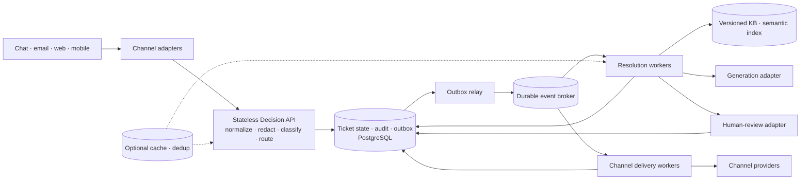

# Целевая архитектура

**Статус:** проектный контракт Slice 3; production infrastructure и основной PoC не реализованы.

Архитектура развивает согласованный [`ticket-processing-flow`](ticket-processing-flow.md): быстрый
путь принимает и маршрутизирует тикет, а resolution, human review и channel delivery выполняются
асинхронно. Цель документа — дать проверяемые component boundaries, data contracts и capacity
assumptions без имитации production completeness.

## Границы и SLO

- Sync decision path: технический acknowledgement и `RoutingDecision`, `p95 <= 500 ms`.
- Async resolution: approved answer, generation или human handoff; медленная модель не входит в
  latency budget hot path.
- SLA содержательного первого ответа в обычном режиме: до 15 минут. Технический status сам по себе
  этот SLA не закрывает.
- При dependency outage приём и human fallback сохраняются, пока доступно транзакционное хранилище.
  Если durable state/audit сохранить нельзя, ingress возвращает retryable failure, а не ложный success.
- Любое автоматическое решение оставляет audit record до внешнего side effect.

## Reference implementation diagram

Product-level обработка остаётся в простой end-to-end схеме
[`ticket-processing-flow`](ticket-processing-flow.md#end-to-end-pipeline). Диаграмма ниже имеет другой
уровень абстракции: она показывает один reference-вариант реализации transport, persistence и async
workers и не является частью пользовательского flow.



- `Channel adapters` валидируют channel-specific envelope и преобразуют его в единый контракт. Для
  chat/web acknowledgement может быть синхронным; email/mobile delivery выполняется отдельным worker.
- `Decision API` остаётся одним stateless deployable: network hops между redaction, classification и
  policy не добавляются без измеримой причины. Горизонтальное масштабирование не меняет state.
- `Ticket store` атомарно сохраняет ticket state, transition, audit и outbox event. Это source of
  truth; cache и broker им не являются.
- `Outbox relay` публикует события с повторными попытками. Broker поглощает burst и независимо
  масштабирует resolution, human integration и delivery consumers.
- `Resolution workers` реализуют exact approved lookup, semantic lookup и generation fallback.
- `Human-review adapter` связывает внутреннее состояние с операторской системой, но недоступность
  LLM не влияет на его очередь.
- `Channel delivery workers` отправляют status/reply events и фиксируют delivery confirmation.

Логические границы не требуют отдельного microservice на каждый блок. Reference topology — Decision
API и несколько типов async worker. Для target design подходят PostgreSQL для state/audit/outbox и
versioned KB, Kafka-compatible broker как durable buffer, Redis только как необязательный cache/dedup
optimization и PostgreSQL/pgvector как стартовый semantic index. В PoC эти сервисы не добавляются.

## Data contracts

### `TicketEnvelope`

- `ticket_id`, `ingress_idempotency_key`, `processing_cycle`, `trace_id`;
- `channel`, `locale`, `received_at`, `customer_ref` в pseudonymized форме;
- `content_redacted`, metadata вложений без сырого содержимого;
- `pii_result`: `redacted | sensitive | redaction_failed | not_detected`;
- optional `incident_id` и source-system reference.

Сырой PII не публикуется в broker и не попадает в model/audit payload. Сам факт найденного и успешно
удалённого PII не запрещает safe automation; `sensitive` или `redaction_failed` fail closed ведут в
human review.

### `RoutingDecision`

- `route`: `automatic_resolution_candidate | human_review_required`;
- `reason_codes`, `intent`, `intent_confidence`, risk/PII flags;
- `policy_version`, `classifier_version`, `decided_at`.

### `StateTransition`

- `ticket_id`, `processing_cycle`, monotonically increasing `state_version`;
- `from_state`, `to_state`, `reason_code`, `occurred_at`;
- `actor`: `system | operator | customer | timer`.

Lifecycle и отображение user statuses приведены отдельной диаграммой в
[`ticket-processing-flow`](ticket-processing-flow.md#минимальный-lifecycle).

### `DeliveryEvent`

- стабильные `event_id` и `idempotency_key` вида
  `ticket_id:processing_cycle:state_version:event_type`;
- `event_type`, `channel`, `payload_ref`, `created_at`.

Event immutable. Изменяемый delivery ledger отдельно хранит `delivery_status` (`pending | confirmed |
retryable_failed | terminal_failed`), `attempt_count` и optional provider idempotency/reference fields.

### `AuditRecord`

- `audit_id`, `ticket_id`, `processing_cycle`, `trace_id`, timestamp;
- `stage`, `action`, `reason_codes`, confidence и применённые thresholds;
- `policy_version`, `model_version`, `knowledge_version`, `content_version`;
- redacted input/output hashes и `evidence_refs`, но не raw PII или полный prompt;
- связанный `state_version`/`event_id` и actor.

Audit append-only: исправление создаёт новую запись, а не меняет историю решения.

## Надёжность доставки событий

### Обнаруженная проблема

Фраза «status events доставляются идемпотентно не более одного раза» смешивала две независимые вещи:

- idempotency означает, что повторная обработка одного события безопасна;
- `at-most-once delivery` исключает retry после неопределённого результата и допускает потерю события.

Например, provider мог принять status, но соединение оборвалось до ответа. Без retry уведомление можно
потерять; с retry consumer обязан ожидать повтор и подавлять повторный пользовательский side effect.

### Принятое решение

- Internal status/reply events доставляются consumers по модели `at-least-once`.
- State transition, `AuditRecord` и outbox event создаются одной DB transaction до отправки.
- Consumer использует стабильный `event_id`; delivery ledger имеет unique constraint по нему и хранит
  attempts/provider reference/confirmation.
- Если provider поддерживает idempotency key, consumer передаёт тот же ключ при retry. После
  подтверждения повторное broker event не вызывает второй provider call.
- `answered` фиксируется только после delivery confirmation; попытка отправки оставляет состояние
  `delivery_pending`.

Это даёт effectively-once internal effect, но не обещает невозможное: если внешний provider не
поддерживает idempotency и оборвал соединение после приёма запроса, абсолютное исключение внешнего
дубля недостижимо. В таком канале используются ledger, provider reconciliation и bounded retry, а
residual duplicate risk остаётся наблюдаемым.

## Failure semantics

| Failure | Поведение | Почему безопасно |
|---|---|---|
| Duplicate ingress | Вернуть существующий `ticket_id` по `ingress_idempotency_key` | Не создаёт второй lifecycle |
| PostgreSQL unavailable | Retryable ingress failure; не подтверждать приём | Нет ответа без durable state/audit |
| Broker unavailable | Commit state/audit/outbox; relay повторяет публикацию | Burst остаётся в durable outbox |
| Redis unavailable | Bypass cache, ограничить нагрузку на source of truth | Cache не влияет на корректность |
| KB/exact unavailable | Не считать outage обычным miss; human fallback | Не генерирует ответ при неизвестном KB state |
| Semantic index unavailable | Human fallback, а не similarity miss | Не обходит match-confidence control |
| LLM unavailable/timeout | Bounded retry, circuit breaker, human path без draft | Ingress и routing не зависят от LLM |
| Human adapter unavailable | Сохранить handoff event и queue age, повторить dispatch | Тикет не теряется и виден monitoring |
| Delivery result unknown | Retry с тем же key; не ставить `answered` | Сохраняет lifecycle и audit ordering |
| Terminal delivery failure | Оставить неотвеченным, alert/operator action | Не выдаёт попытку за доставленный ответ |

## Capacity и latency

### Входной поток

| Режим | Расчёт | Поток |
|---|---:|---:|
| Средний | `200,000 / 86,400` | `2.31 ticket/s` |
| Burst lower bound | `10,000 / 600` | `16.7 ticket/s` |
| Observed peak | `20,000 / 600` | `33.3 ticket/s` |
| Design target, 2x headroom | `33.3 * 2` | `66.7 ticket/s` |

2x — стартовый sizing assumption, а не подтверждённый production forecast. При SLO `p95 <= 500 ms`
нижняя оценка одновременной работы по Little’s Law равна `ceil(66.7 * 0.5) = 34` in-flight tickets.
Replica count из этого не выводится без реальных service-time, CPU/memory и dependency measurements.

### Hot-path latency budget

| Стадия | p95 budget |
|---|---:|
| Ingress validation и normalization | 40 ms |
| PII redaction и risk rules | 120 ms |
| Intent classification и confidence | 150 ms |
| Routing policy | 40 ms |
| State + audit + outbox transaction | 80 ms |
| Network/runtime reserve | 70 ms |
| **Итого** | **500 ms** |

Это бюджеты для проектирования и будущей инструментализации, не результаты замеров. Channel-provider
delivery, retrieval и generation в таблицу не входят.

### Queue growth и drain

Для входного потока `lambda`, consumer capacity `mu` и burst duration `T`:

- `backlog = max(0, lambda - mu) * T`;
- после burst при `mu > lambda_post` время drain равно `backlog / (mu - lambda_post)`.

Если 20k backlog уже накоплен, а вход продолжает идти с observed peak, свободная capacity
`66.7 - 33.3 = 33.4 ticket/s` дренирует его примерно за 10 минут. Если вход вернулся к среднему
`2.31 ticket/s`, свободные `64.4 ticket/s` дают около 5.2 минуты. В нормальном режиме consumers
работают и во время burst, поэтому оба расчёта — capacity envelopes, а не ожидаемый lag. Queue age, а
не только queue length, является SLA-сигналом.

### Branch capacity и human limit

- Direct approved path должен масштабироваться до design target и не создавать LLM amplification.
- Generation ограничивается concurrency/rate/cost caps; incident duplicates используют один
  versioned approved response/cache, а не отдельный LLM call на тикет.
- 40% типовых обращений — верхняя оценка candidate pool, не гарантированный direct-answer share.
- Human capacity нельзя вывести из system throughput. Иллюстративный worst-case: если 60% от 20k
  burst требуют ручной обработки, это 12k тикетов или 96k operator-minutes. Для содержательного ответа
  за 15 минут потребовалось бы 6,400 одновременно работающих операторов. Это не forecast, а
  доказательство необходимости incident detection, deduplication, approved incident response и
  отдельного degraded-mode SLA.

## PoC и evidence boundary

| Область | Slice 3 / PoC evidence | Target design |
|---|---|---|
| Hot path | Synthetic deterministic adapters, локальный microbenchmark | Реальные redaction/classifier services |
| State/audit | Контракты; реализация остаётся tracer-path scope | PostgreSQL transaction + outbox |
| Async transport | Не поднимается | Kafka-compatible durable broker |
| Cache/vector search | Не поднимаются | Redis optional, PostgreSQL/pgvector reference |
| Lifecycle timer | Simulated clock/`advance` в будущем PoC | Durable scheduler/timer events |

Microbenchmark Slice 3 измеряет только Python orchestration ceiling на синтетических данных. Он не
доказывает latency внешних моделей, PostgreSQL, broker или channel providers и не используется для
выбора production replica count.

## Критерий готовности

- Processing и lifecycle diagrams проходят Mermaid parsing.
- Data contracts позволяют связать ingress, route, state transition, audit и delivery event.
- Duplicate/retry/outage scenarios имеют безопасный и наблюдаемый результат.
- Capacity arithmetic воспроизводится, assumptions отделены от измерений.
- Synthetic benchmark достигает `>= 67 ticket/s` и `p95 <= 500 ms`, сохраняя явную evidence boundary.

## Verification evidence Slice 3

Команды:

```bash
python3 -m unittest discover -s tests -v
python3 scripts/benchmark_hot_path.py --tickets 20000 --warmup 1000 \
  --min-throughput 67 --max-p95-ms 500
```

Локальный запуск 2026-08-09 на CPython 3.13, Darwin arm64: 6 unit tests прошли; synthetic path —
около `273,186 ticket/s`, `p95 = 0.00325 ms`, threshold result `passed: true`. Результат намеренно не
используется для production sizing: он подтверждает только низкий overhead deterministic Python
harness и корректность threshold/reporting механики.
