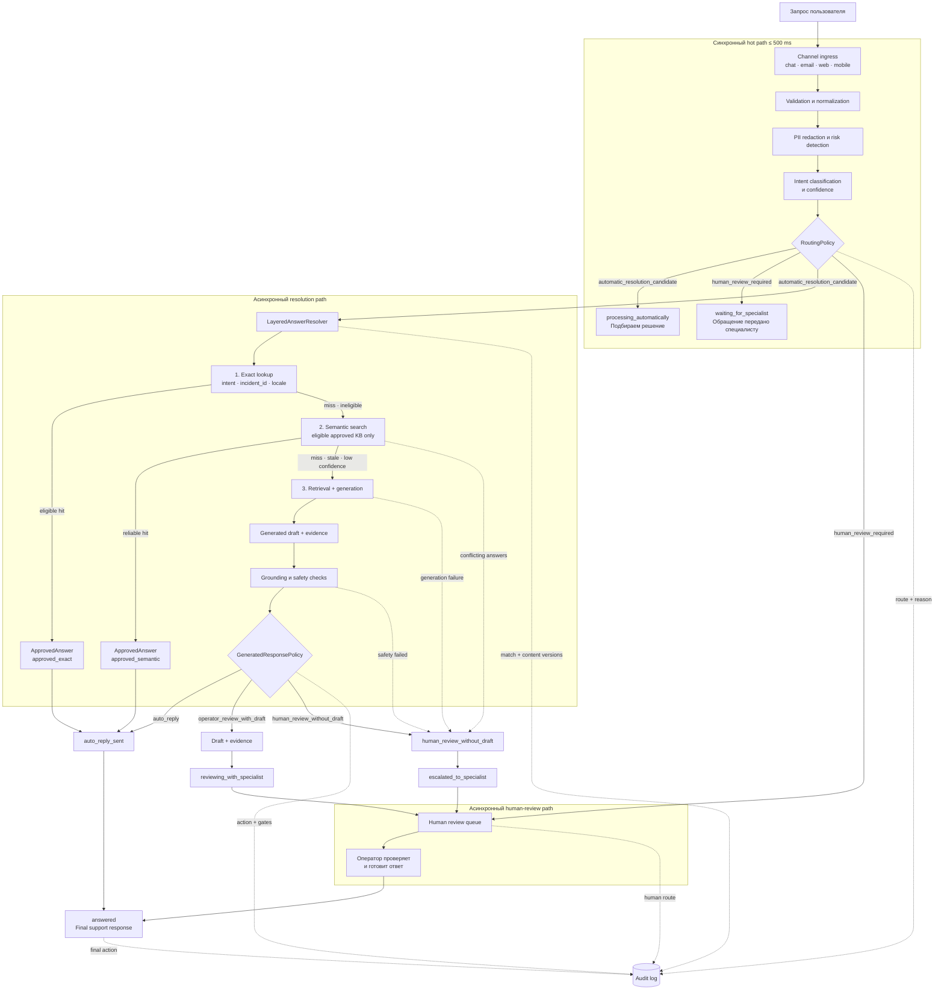

# Контракт обработки тикета

**Статус:** проектный контракт Slice 2; реализация отсутствует.

Документ определяет outcomes, policy, пользовательские статусы и end-to-end flow. Компонентные
границы целевой системы описаны в [`docs/architecture.md`](architecture.md), исходные требования — в
[`docs/original-requirements.md`](original-requirements.md).

## Продуктовая граница

Около 40% типовых и повторяющихся обращений — верхняя оценка пула кандидатов на дешёвый direct-answer
path, а не обещанная доля auto-reply и не требование вызывать LLM для каждого такого тикета. Система
сначала пытается вернуть versioned approved text из knowledge base и использует generation только
при отсутствии надёжного готового ответа.

## Policy и outcomes

Контроли разделены по происхождению ответа:

- `RoutingPolicy` на синхронном hot path выбирает `human_review_required` или
  `automatic_resolution_candidate`;
- `LayeredAnswerResolver` сам проверяет eligibility для готовых approved answers;
- `GeneratedResponsePolicy` применяется только к сгенерированному draft и выбирает `auto_reply`,
  `operator_review_with_draft` или `human_review_without_draft`.

`LayeredAnswerResolver` работает вне hot path в следующем порядке:

1. Exact lookup по `intent`, `incident_id` и `locale` возвращает versioned `ApprovedAnswer`, только
   если он active, актуален и имеет `auto_reply_eligible = true`. Иначе результат считается miss.
2. При miss выполняется semantic search только среди таких же eligible approved KB entries. После
   lookup применяется единственный дополнительный gate — подтверждённый semantic-match confidence.
3. Stale или low-confidence match переводится в retrieval + generation; конфликтующие approved
   ответы переводятся в human review без draft.

Direct-answer path не вызывает генеративную модель и не проходит отдельную `ResponsePolicy`:
eligibility exact-ответа является частью lookup, а semantic-ответ после предварительной фильтрации
проходит только match-confidence gate. Incident mode и auto-reply kill switch учитываются при
формировании eligible candidate set. Generated draft требует evidence, grounding, safety result и
отдельное решение `GeneratedResponsePolicy`. Если draft пригоден для оператора, но auto-reply
запрещён, оператор получает draft вместе с evidence. Unsafe draft не передаётся оператору как
готовый ответ.

Итоговый outcome:

- `auto_reply` → `answered`;
- `operator_review_with_draft` → human review с draft и evidence → `answered`;
- `human_review_without_draft` → human review без непроверенного draft → `answered`.

## Минимальные data contracts

### `ApprovedAnswer`

- `answer_id`, `version`, `locale`, `text`;
- `match_keys`: поддерживаемые `intent`, `incident_id` и exact keys;
- `source_ref`, `valid_from`, `valid_until`, `status`;
- `auto_reply_eligible`.

### `AnswerCandidate`

- `origin`: `approved_exact | approved_semantic | generated`;
- `content`, `evidence_refs`, `confidence`;
- `safety_result`: `passed | failed | not_applicable`;
- версии resolver/model/knowledge, необходимые для audit.

### `GeneratedResponsePolicyAction`

- `auto_reply`;
- `operator_review_with_draft`;
- `human_review_without_draft`.

## Пользовательские статусы и lifecycle

- `processing_automatically`: «Запрос принят. Подбираем решение»;
- `waiting_for_specialist`: «Чтобы дать точный ответ, мы передали обращение специалисту»;
- `reviewing_with_specialist`: «Ответ подготовлен и передан специалисту на проверку»;
- `escalated_to_specialist`: «Автоматически подготовить ответ не получилось. Обращение уже передано
  специалисту; повторно описывать проблему не нужно»;
- `answered`: содержательный ответ доставлен пользователю.

`reviewing_with_specialist` используется только для пригодного draft. `escalated_to_specialist`
отправляется только после фактической смены route из-за conflict/failure, когда пригодного draft нет,
а не при отдельном retry. Status events доставляются идемпотентно не более одного раза на один переход
состояния.

Lifecycle после auto-reply намеренно не показан на Mermaid: тикет переходит в `pending_customer`,
ответ пользователя в течение 24 часов возвращает его в routing, а отсутствие ответа разрешает
auto-close через 24 часа.

## End-to-end pipeline

## Инварианты и fallback

- Risky, PII-sensitive и low-confidence тикет не входит в `LayeredAnswerResolver`.
- Exact lookup возвращает только active, актуальный и `auto_reply_eligible` content; остальные
  результаты считаются miss.
- Semantic lookup ищет в том же eligible candidate set и не отправляет match ниже подтверждённого
  confidence threshold.
- LLM/retrieval outage не блокирует приём тикета и human fallback.
- Incident mode предпочитает versioned approved incident response/cache и не создаёт LLM-вызов на
  каждый дубликат.
- Каждый route, lookup/match, generated policy action, content/model version и итоговое действие
  оставляют audit record.
